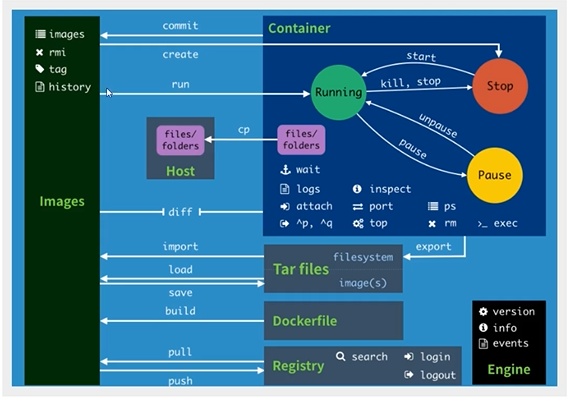

# Docker 笔记

> **出现原因：**一款产品：开发环境！应用环境！ 两个环境。布制麻烦。多集群配置难


## 安装Docker

> 查看环境

```shell
# 系统内核
[root@localhost ~]# uname -r
3.10.0-1160.el7.x86_64
```

> 查看配置信息

```shell
# 系统版本
[root@localhost ~]# cat /etc/os-release 
NAME="CentOS Linux"
VERSION="7 (Core)"
ID="centos"
ID_LIKE="rhel fedora"
VERSION_ID="7"
PRETTY_NAME="CentOS Linux 7 (Core)"
ANSI_COLOR="0;31"
CPE_NAME="cpe:/o:centos:centos:7"
HOME_URL="https://www.centos.org/"
BUG_REPORT_URL="https://bugs.centos.org/"

CENTOS_MANTISBT_PROJECT="CentOS-7"
CENTOS_MANTISBT_PROJECT_VERSION="7"
REDHAT_SUPPORT_PRODUCT="centos"
REDHAT_SUPPORT_PRODUCT_VERSION="7"
```

> 地址：https://docs.docker.com/engine/install/centos/

> 安装

```shell
# 1.删除旧版本
yum remove docker \
                  docker-client \
                  docker-client-latest \
                  docker-common \
                  docker-latest \
                  docker-latest-logrotate \
                  docker-logrotate \
                  docker-engine
# 2.安装包
yum install -y yum-utils
# 3.设置镜像仓库
sudo mkdir -p /etc/docker
sudo tee /etc/docker/daemon.json <<-'EOF'
{
  "registry-mirrors": ["https://xirgurp7.mirror.aliyuncs.com"]
}
EOF
sudo systemctl daemon-reload
sudo systemctl restart docker

// yum-config-manager \
//    --add-repo \
//    https://download.docker.com/linux/centos/docker-ce.repo # 默认国外的
//    http://mirrors.aliyun.com/docker-ce/linux/centos/docker-ce.repo # 阿里云
    
# 4.安装dokcer相关 ce:社区 ee：企业
yum install docker-ce docker-ce-cli containerd.io
# 5.更新下yum索引
yum makecache fast
# 6.启动docker
systemctl start docker
# 7.查看是否安装成功
[root@localhost ~]# docker version
Client: Docker Engine - Community
 Version:           20.10.2
 ......
 # 8.测试
docker run hello-world
 # 9.查看镜像
docker images
```

> 删除 Docker

```shell
# 删除依赖
yum remove docker-ce docker-ce-cli containerd.io
# 删除目录
rm -rf /var/lib/docker
```

## 基本命令

### 镜像的基本命令

#### 帮助命令

```shell
docker version    # 版本信息
docker info		  # docker 系统信息 包括镜像和容器
docker 命令 --help # 帮助
```

帮助文档的地址：https://docs.docker.com/reference/

docker images  查看本机镜像

```sh
# 查看本机镜像
[root@localhost ~]# docker images
REPOSITORY    TAG       IMAGE ID       CREATED         SIZE
hello-world   latest    bf756fb1ae65   12 months ago   13.3kB

REPOSITORY 镜像的仓库源
TAG        镜像的标签
IMAGE ID   镜像的ID
CREATED    镜像的创建时间
SIZE       镜像的大小

# 可选项
	-a --all   # 列出所有镜像
	-q --quiet # 只显示镜像ID
```

**搜索:**  docker search 镜像名

**下载：**docker pull 镜像名[:tag]

**删除：**docker rmi -f 镜像ID / docker rmi -f ${docker images -aq} / docker rmi -f 镜像ID 镜像ID

### 容器的基本命令

**说明：有了镜像才能有容器**

**新建容器并启动**

```shell
docker rum [可选参数] image 

# 参数说明
--name="Name"     容器的名字 用来区分容器
-d                后台方式运行
-it               交互方式运行
-p		          小p指定容器的端口 -p 8080:8000
	-p ip:主机端口:容器端口
	-p 主机端口：容器端口(常用)
	-p 容器端口
-P                大P随机指定容器端口

# 启动并进入容器
[root@localhost ~]# docker run -it centos /bin/bash
[root@2d3efd2b9cd4 /]# ls # 内部是简化的
bin  dev  etc  home  lib  lib64  lost+found  media  mnt  opt  proc  root  run  sbin  srv  sys  tmp  usr  var
# 从容器中退出
exit

```

**列出所有运行容器**

```shell
# docker ps
-a   # 列当前运行容器+历史运行
-n=? # 列出最新创建的容器
-q   # 只显示容器编号 
[root@localhost ~]# docker ps
CONTAINER ID   IMAGE     COMMAND   CREATED   STATUS    PORTS     NAMES
[root@localhost ~]# docker ps -a
CONTAINER ID   IMAGE         COMMAND       CREATED             STATUS                         PORTS     NAMES
2d3efd2b9cd4   centos        "/bin/bash"   3 minutes ago       Exited (127) 50 seconds ago              happy_mclaren
e3c4e909b42e   hello-world   "/hello"      About an hour ago   Exited (0) About an hour ago             epic_lederberg
[root@localhost ~]# 

```

**退出容器**

```shell
exit # 直接退出容器
Ctrl + P + Q # 容器不停止退出
```

**删除容器**

```shell
docker rm 容器ID				  # 删除指定容器，不能删除正在运行的容器。强制删除 rm -f
docker rm -f $(docker ps -aq)  # 删除所有容器
docker ps -a -q|xargs docker rm # 删除所有容器
```

**启动停止容器**

```shell
docker start 容器ID   # 启动容器
docker restart 容器ID # 重启容器
docker stop 容器ID    # 停止当前正在运行的容器
docker kill 容器ID    # 强制停止当前容器
```

### 常用的其它命令

**后台启动**

```shell
# 后台运行
docker run -d 镜像名
# 常见的坑：容器启动后发现自己没有提供服务就自己停止了。
```

**查看日志**

```shell

# 查看日志
-tf           # 显示日志
--tail number # 要显示日志条数
docker logs -f -t --tail 容器ID
```

**查看窗口中进程信息**

```shell
# top命令 docker top 容器ID
[root@localhost ~]# docker top 2d3efd2b9cd4
UID                 PID                 PPID                C                   STIME               TTY                 TIME                CMD
root                3805                3784                0                   22:25               pts/0               00:00:00            /bin/bash

```

**查看容器的元数据**

```shell
# docker inspect 容器ID
[root@localhost ~]# docker inspect 2d3efd2b9cd4

```

**进入当前正在远行的容器**

```shell
# 新开一个命令行
docker exec -it 容器ID bashShell
# 进入下在运行的命令行
docker attach 容器ID 
```

**从容器中拷贝数据到主机**

```shell
# docker cp 容器ID：原路径+文件名 新路径
[root@localhost ~]# docker attach 2d3efd2b9cd4
[root@2d3efd2b9cd4 /]# ls
bin  dev  etc  home  lib  lib64  lost+found  media  mnt  opt  proc  root  run  sbin  srv  sys  tmp  usr  var
[root@2d3efd2b9cd4 /]# cd home/
[root@2d3efd2b9cd4 home]# touch test.java 
[root@2d3efd2b9cd4 home]# ls
test.java
[root@2d3efd2b9cd4 home]# exit
[root@localhost /]# docker cp 2d3efd2b9cd4:/home/test.java /home
[root@localhost /]# ls
bin  boot  dev  etc  home  lib  lib64  media  mnt  opt  proc  root  run  sbin  srv  sys  test.java  tmp  usr  var
[root@localhost /]# cd home/
[root@localhost home]# ls
test.java

```



## Docker镜像生成

```shell
docker commit # 提交一个容器成为新的镜像
docker connit -m="描述信息" -a="作者" 容器ID 目标镜像名，[TAG]
```

## 窗口数据卷

### 什么是容器数据卷

> 原因：数据在容器中，容器删除数据就丢失。==需求数据存在本地==

**使用数据卷**

> 方式一：命令方式

```shell
docker run -id -v 主机目录：容器内目录
```

### 具名和匿名挂载

```shell
# 匿名挂载
[root@localhost ~]# docker run -d -P --name nginx01 -v /etc/nginx nginx

# 查看挂载方式 docker volume ls
[root@localhost ~]# docker volume ls
DRIVER    VOLUME NAME
local     4f7df94b6ea3201b6f5c57704b8048d6a4dde152b1c83fac115f5a85c937f089

# 具名挂载
[root@localhost ~]# docker run -d -P --name nginx02 -v gm_nginx:/etc/nginx nginx
69925b49d93d4b04e5624fc6d77a3d7bcc449dfd969d4ec4cbc3b8143cf552ac
[root@localhost ~]# docker volume ls
DRIVER    VOLUME NAME
local     4f7df94b6ea3201b6f5c57704b8048d6a4dde152b1c83fac115f5a85c937f089
local     gm_nginx
[root@localhost ~]# 

# 查看卷在本机的位置 docker volume inspect 卷名
[root@localhost ~]# docker volume inspect gm_nginx
[
    {
        "CreatedAt": "2021-01-20T21:06:14+08:00",
        "Driver": "local",
        "Labels": null,
        "Mountpoint": "/var/lib/docker/volumes/gm_nginx/_data",
        "Name": "gm_nginx",
        "Options": null,
        "Scope": "local"
    }
]
[root@localhost ~]# 

```

所有的docker容器内的卷，在没有指定本地路径时默认路径`var/lib/docker/volumes/xxxx/_data`

大多数情况下用==具名挂载==

```shell
# 匿名具名的区别
-v 容器路径              #  匿名
-v 名字:容器路径          #  具名
-v /宿主机路径:容器内路径   #  指定路径
```

### 容器之间数据共享

```shell
--volumes-form
```


### Dockerfile

> 定义：Dockerfile 就是用来构建 docker镜像的构建文件，命令脚本

