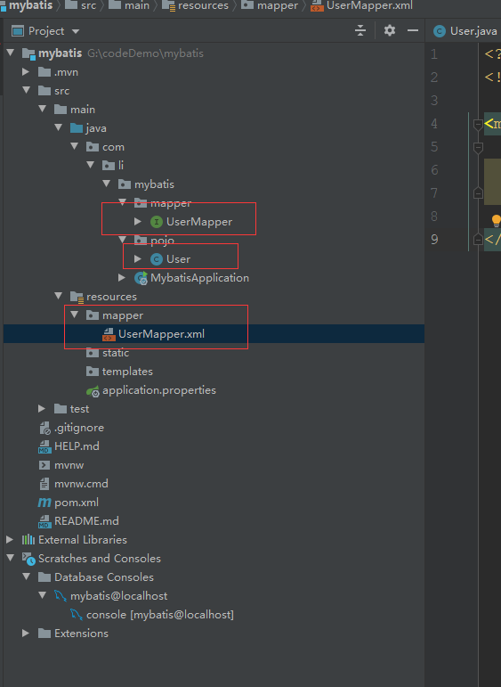

# Spring-Boot整合mybatis


## 引入

```
        <dependency>
            <groupId>org.mybatis.spring.boot</groupId>
            <artifactId>mybatis-spring-boot-starter</artifactId>
            <version>1.3.2</version>
        </dependency>
        <dependency>
            <groupId>org.springframework.boot</groupId>
            <artifactId>spring-boot-starter-jdbc</artifactId>
        </dependency>
        <dependency>
            <groupId>org.springframework.boot</groupId>
            <artifactId>spring-boot-starter-web</artifactId>
        </dependency>

        <dependency>
            <groupId>mysql</groupId>
            <artifactId>mysql-connector-java</artifactId>
            <scope>runtime</scope>
        </dependency>
```

## 编辑配置文件

```
# 数据库驱动：
spring.datasource.driver-class-name=com.mysql.cj.jdbc.Driver
# 数据源名称
spring.datasource.name=mybatis
# 数据库连接地址
spring.datasource.url=jdbc:mysql://localhost:3306/mybatis?serverTimezone=UTC
# 数据库用户名&密码：
spring.datasource.username=root
spring.datasource.password=root

mybatis.type-aliases-package=com.li.mybatis.pojo
mybatis.mapper-locations=classpath:mapper/*.xml

```


## mybatis

```
<?xml version="1.0" encoding="UTF-8"?>
<!DOCTYPE mapper PUBLIC "-//mybatis.org//DTD Mapper 3.0//EN"
        "http://mybatis.org/dtd/mybatis-3-mapper.dtd">
<mapper namespace="com.li.mybatis.mapper.UserMapper">
    <select id="getUser" resultType="User">
        select * from user where id = #{id}
    </select>

</mapper>
```


## 代码结构

