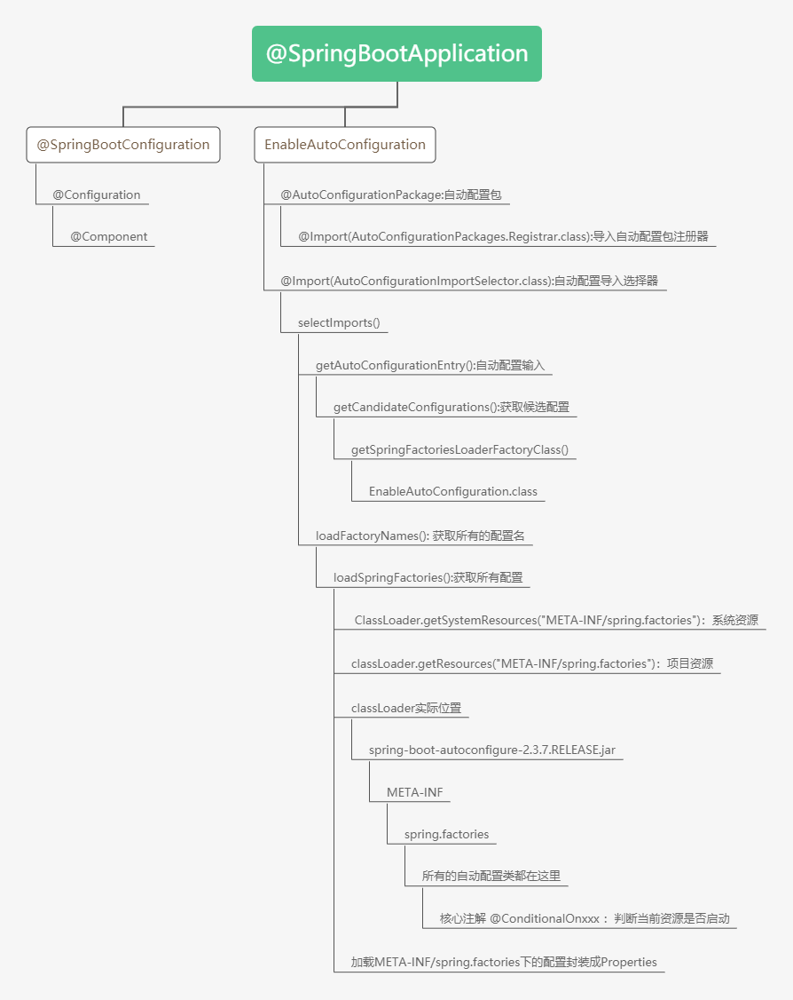
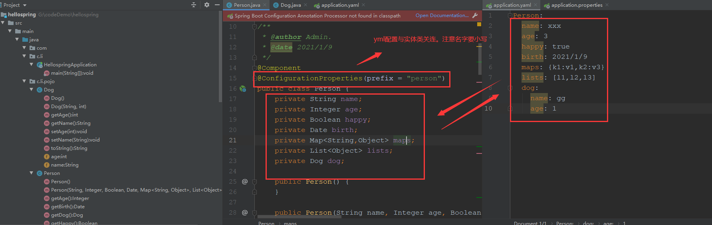
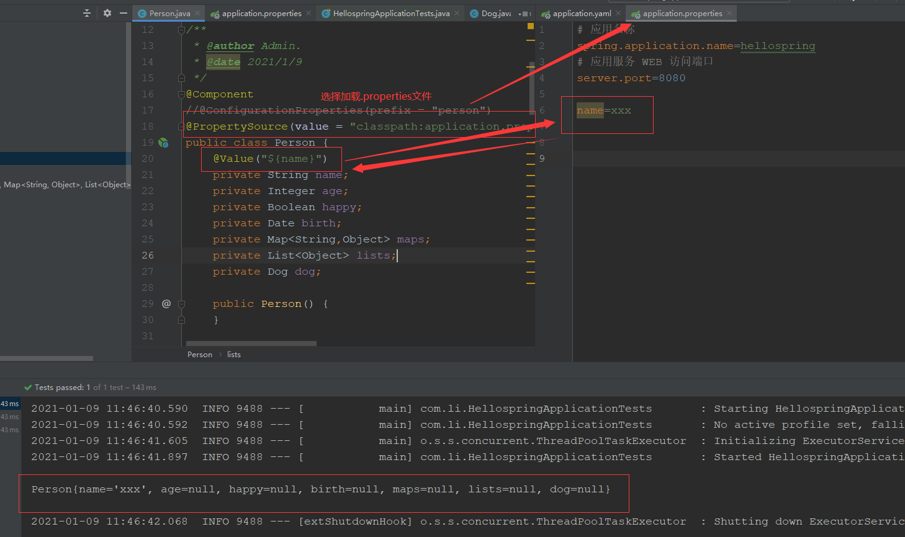

# Spring-boot

> 核心： 自动装配
>
> xxxAutoConfigurartion：自动配置类；给容器添加组件
>
> xxxProperties：封装配置文件中相关属性
>
> debug: true：查看哪些生效
>
> [官网](https://docs.spring.io/spring-boot/docs/2.3.7.RELEASE/reference/htmlsingle/)

## 自动装配原理



## 结论

​	springboot所有自动配置都在启动时扫描并加载了META-INF/spring.factories所有的自动配置类。但不一定生效，要满足注解@ConditionalOnxxx，才会生效。就是在pom.xml文件中设置start

1. springboot在启动时从类路径下/META-INF/spring.factories获取指定的值；
2. 将这些自动配置类导入容器，通过@ConditionalOnxxx判断生效，自动配置；
3. springboot所有的自动配置都在spring-boot-autoconfigure-2.3.7.RELEASE.jar包下
4. 所需要导入的组件是以类名方式返回
5. 容器(META-INF/spring.factories)中的xxxAutoConfiguration（@Bean）文件就是这些容器导入场景需要的所有组件。

## yaml

```yaml

# 对象
student:
	name: xxx
	age: 3
# 行内写法
student: {name: xxx,age: 3}
# 数组
pets:
	- cat
	- dog
pets: [cat,dog]
```

### 给类赋值



## properties配置



**Maven辅助包**

```xml
spring-boot-configuration-processor
```


##  JSR-303 数据效验

```java
@Validated
```

## 配置文件位置与优先级

```
1.file:./config/
2.file:./config/*/
3.file:./
4.classpath:/config/
5. classpath:/
```

